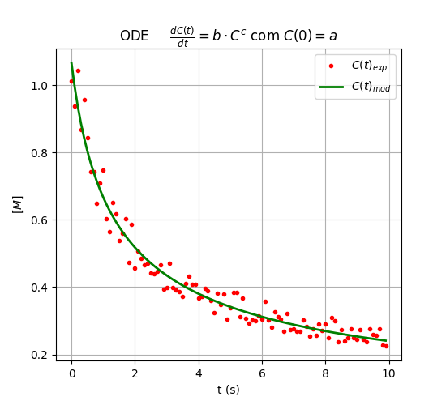

## Synopsis

Pequenos scripts em python com o propósito de ensinar Engenharia Química, nomeadamente reactores e dinâmica de sistemas e controlo de processos.

## Code Example

Existem dois tipos de scropts:
- SageCell
- python

## Motivation

Ensinar.

## Installation

Ex:
python fig_2.py

## Resultados
> 1- fig_2.py

############################################
############################################
             Co            k            n        %erro
    -------  ------  ---  ------  ---  ------  ----  --------
    Dados    1            -1           3             30.00
 
    Obtidos  1.0668       -0.651       2.7603        r=0.9833

> 2- em breve

## API Reference

Depending on the size of the project, if it is small and simple enough the reference docs can be added to the README. For medium size to larger projects it is important to at least provide a link to where the API reference docs live.

## Tests

Describe and show how to run the tests with code examples.

## Contributors

Let people know how they can dive into the project, include important links to things like issue trackers, irc, twitter accounts if applicable.

## License

A short snippet describing the license (MIT, Apache, etc.)
